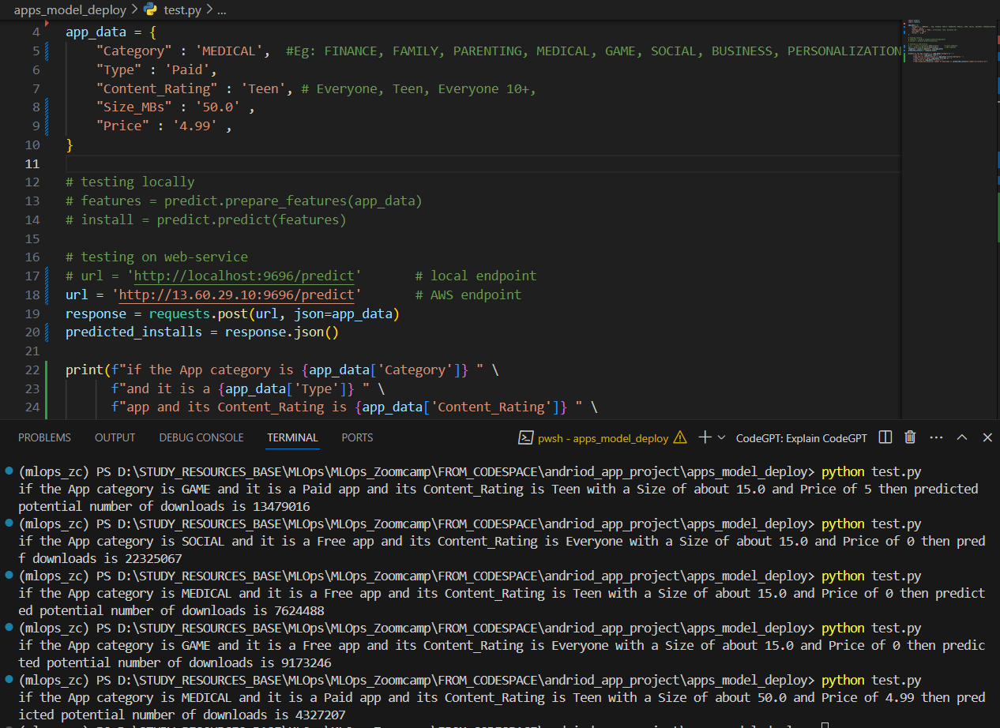

# Andriod Apps Pricing and Revenue Forecasting project

## Overview
This project focuses on a comprehensive analysis of the Android apps market by analysing thousands of apps in the Android Play store. The overall goal is to develop an app pricing and revenue forecasting mechanism to make data-informed decisions in pricing and categorizing new apps to ensure their success in the Android app market.

## Prerequisites
Ensure that you have the following dependencies installed before setting up the project environment:
- Python 3.9
- Python 3.9 development tools
- Python 3.9 virtual environment

## Technologies used in this project
The following technologies were used at different stages:
- VSCode : IDE
- Python 3.9 
- Jupyter Notebook : For Exploratory Data Analytics 
- Scikit-learn : ML models development
- MLFlow : For ML expirement tracking 
- Flask : For packaging the model as web-service application
- Docker : For containerizing the application. Docker image on Docker Hub `skdarkey/number-of-app-installs-prediction:v1`
- AWS ECS : For deployment of application container.

## Project Structure
```
│
├── notebooks/
│   ├── Google_Play_Store_App_Analytics.ipynb : Preliminary Data Analytics notebook and visualizations
│   ├── apps_ml_prf.ipynb : Notebook for model development.
│   └── Google_Play_Store_App_Analytics.csv : Data used.
│
├── models/
│   └── numinstalls_lin_reg2.bin : saved model for predicting number of installs
│
├── apps_model_deploy/
│   ├── Pipfile : packages used in model deployment.
│   ├── Pipfile.lock : Pipenv dependencies lock file for deployment env
|   ├── python_env.yaml : python dependencies for model development env
│   ├── Dockerfile : Dockerfile prepared for containerizing the model 
│   ├── test.py : application testing script to test deployed model
│   └── predict.py : the application script that calls the model
│
├── Assets/
│   ├── this directory contains screenshot from model deployment on aws
│   ├── apps-cluster.png : aws ecs cluster created 
│   ├── apps-task-definition.png : task definition to run service
│   ├── apps-Service.png : running service based on task definition.
│   └── apps-local-inferencing-results.png: deployed model's outputs
│
└── README.md
```
## Deployment Screenshots

* AWS ECS Cluster showing the running service.


* Running Service


* Task definition


* Overwiew of running Task showing container details and public IP


* Deployed model output

